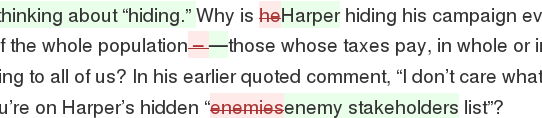
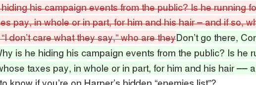
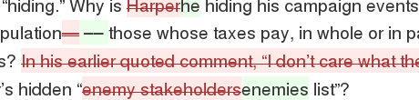

#\#hairgate

Pretty diffs of all the changes to Margaret Attwod's article about hair. Why not.

### [NatPo Original ↔ Walrus](https://github.com/uniphil/hairgate/compare/original...walrus?short_path=5322792)

### [NatPo Original ↔ NatPo Republished](https://github.com/uniphil/hairgate/compare/original...reposted?short_path=5322792)

### [Walrus ↔ NatPo Reposted](https://github.com/uniphil/hairgate/compare/walrus...reposted-from-walrus?short_path=5322792)

## Sources

### [NatPo Original](http://webcache.googleusercontent.com/search?q=cache%3ANNY9M7J2kGIJ%3Anews.nationalpost.com%2Ffull-comment%2Fmargaret-atwood-stephen-harpers-bad-hair-days+&cd=1&hl=en&ct=clnk&gl=ca)

via Google webcache, which saved the page 21 Aug 2015 17:54:07 GMT.

### [Walrus](http://thewalrus.ca/stephen-harpers-hair-problem/)

Accessed 21 Aug 2015 about 23:30.

### [NatPo Republished](http://news.nationalpost.com/full-comment/hair-is-in-the-election-season-air-but-is-it-crucial-to-your-vote)

Accessed 21 Aug 2015 about 23:20
